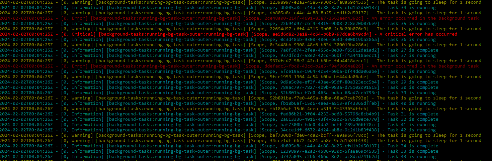

# openlog-rotating  [](https://github.com/christopher-gritton/openlog-rotating/actions/workflows/dotnet.yml)
Rotating file logging library for C#

This library is a simple file logging library that supports log rotation. It can be used with or without Microsoft.Extensions.Logging.
The number of days to keep the log files can be configured. The library will automatically delete log files older than the specified number of days.
The maximum file size for a log file before it is rotated can also be configured. The library will automatically rotate the log file when the maximum file size is reached.


## Usage with Microsoft.Extensions.Logging

```csharp

using ElkCreekServices.OpenScripts.Logging;

namespace ElkCreekServices.OpenScripts.Logging.Example;

class Program
{
    static void Main(string[] args)
    {
        using var loggerFactory = LoggerFactory.Create(builder =>
        {
            builder
                .AddFilter("Microsoft", LogLevel.Warning)
                .AddFilter("System", LogLevel.Warning)
                .AddFilter("OpenScripts.Logging.Example", LogLevel.Warning) // set the log level for this namespace
                .AddRotatingFileLogger(config =>
                {
                    //add a new configuration for the logger
                    config.Add(new RotatingLoggerConfiguration()
                    {
                        Name = "default",
                        LogLevel = LogLevel.Trace,
                        ConsoleLoggingEnabled = true,
                        ConsoleMinLevel = LogLevel.Trace,
                        Filename = new System.IO.FileInfo("./logging/log_program.txt"),
                        IncludeDateTime = true,
                        IsUtcTime = true,
                        PurgeAfterDays = 2,
                        AutoGenerateDirectory = true,
                        AttemptAutoFileRenameOnIOException = true,
                        MaximumLogFileSizeKB = (1024 * 1024 * 10)
                    });
                });
        });

        // Create a logger
        ILogger logger = loggerFactory.CreateLogger<Program>();

        logger.LogInformation("Example log message");

        using (var scopedLogger = logger.BeginScope("scopeId"))
        {
            logger.LogInformation("Example scoped log message");
            using (var nestedScopedLogger = logger.BeginScope("nestedScopeId"))
            {
                logger.LogInformation("Example nested scoped log message");
                logger.LogWarning("Example nested scoped log warning");
            }
        }
    }
}

```


## Usage without Microsoft.Extensions.Logging.LoggerFactory

`Note: The library will still have dependencies on the Microsoft.Extensions.Logging.Abstractions and Microsoft.Extensions.Logging.Configuration packages`


```csharp

using ElkCreekServices.OpenScripts.Logging;

namespace ElkCreekServices.OpenScripts.Logging.Example;

class Program
{
    static void Main(string[] args)
    {

        using (RotatingFileLoggerFactory logger = new RotatingFileLoggerFactory(string.Empty, () => new RotatingLoggerConfiguration()
        {
            LogLevel = LogLevel.Trace,
            Filename = new System.IO.FileInfo("./logging/log_example.txt"),
        }))
        {
            try
            {
                throw new Exception("This is a test exception");
            }
            catch (Exception ex)
            {
                logger.LogError(ex, "An error occurred in the main method");
            }

            logger.LogInformation("Example log message"); //extension methods for log levels

            using (logger.BeginScope("scopeId"))
            {
                logger.LogInformation("Example scoped log message");
                using (logger.BeginScope("nestedScopeId"))
                {
                    logger.LogInformation("Example nested scoped log message");
                    logger.LogWarning("Example nested scoped log warning");
                }
            }

            //non - extension methods for log levels
            logger.Log(LogLevel.Information, new EventId(0), "Example log message without extension methods");
        }

    }
}

```

### Configuration in appsettings.json

``` json

{
  "Logging": {
    "LogLevel": {
      "Default": "Information",
      "Microsoft": "Warning",
      "System": "Warning"
    },
    "RotatingFile": {
        "Configurations": [
            {
                "LogLevel": "Trace",
                "ConsoleLoggingEnabled": true,
                "ConsoleMinLevel": "Trace",
                "Filename": "./logging/log_default.txt",
                "IncludeDateTime": true,
                "IsUtcTime": true,
                "PurgeAfterDays": 2,
                "AutoGenerateDirectory": true,
                "AttemptAutoFileRenameOnIOException": true,
                "MaximumLogFileSizeKB": "10485760"
            }
        ]
    }
}

```


### Example of output to console

  

#### Todo 

- Finish unit tests
- Update documentation
